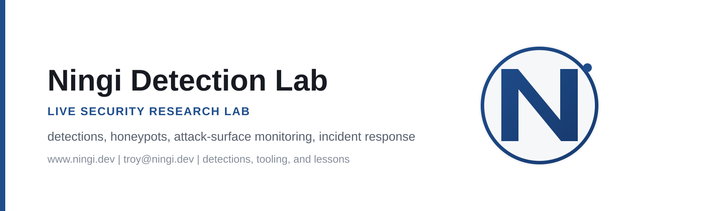

# Troy | Homelab Security Research

Public site: [ningi.dev](https://ningi.dev)

This repo shows the security work I built and ran in my homelab: detections, honeypot monitoring, attack surface checks, malware notes, and incident response.

It is all based on a live environment. That includes a real compromise in March 2026 that I investigated and documented in full. I left that in because I want this repo to show how I actually work, not just the clean wins.

## Start Here

- [NINGI-WRITEUP-007](writeups/NINGI-WRITEUP-007-what-i-rebuilt-after-the-znc-compromise.md) - rebuild notes, current stack, and why I left the compromise in
- [NINGI-WRITEUP-006](writeups/NINGI-WRITEUP-006-znc-webadmin-compromise-cryptominer.md) - incident response, root cause analysis, rebuild lessons
- [NINGI-WRITEUP-001](writeups/NINGI-WRITEUP-001-honeytoken-detection.md) - detection engineering with auditd, Wazuh, and alerting
- [NINGI-2026-001](security-findings/NINGI-2026-001-siem-log-injection.md) - how I found, tested, and fixed a SIEM log issue
- [NINGI-WRITEUP-003](writeups/NINGI-WRITEUP-003-attack-surface-monitoring.md) - how I check the lab from the outside

## What This Repo Shows

- Custom Wazuh detections for honeytokens, suspicious activity, and public exposure changes
- Cowrie SSH honeypot operation with real attacker traffic
- Python and shell tools for alerts, daily digests, and outside checks
- Malware notes from captured payloads and source
- A full writeup of a real host compromise and the rebuild that followed

## Repo Contents

### Security Findings

- [NINGI-2026-001](security-findings/NINGI-2026-001-siem-log-injection.md) - SIEM log injection via IPv6 UDP syslog
- [NINGI-2026-002](security-findings/NINGI-2026-002-ssh-tunnel-relay-c2.md) - SSH tunnel relay abuse and CDN-fronted C2 beaconing
- [NINGI-2026-003](security-findings/NINGI-2026-003-znc-ipv6-exposure.md) - ZNC webadmin IPv6 exposure that led to the March 2026 compromise
- [NINGI-2026-004](security-findings/NINGI-2026-004-ssh-dns-tunnel-via-direct-tcpip.md) - SSH direct-tcpip abused as DNS exit proxy; no-shell tunnel to 1.1.1.1:53

### Technical Writeups

- [NINGI-WRITEUP-008](writeups/NINGI-WRITEUP-008-kamado-joe-api-reverse-engineering.md) - Kamado Joe Konnected IoT API reverse engineering and cloud control notes
- [NINGI-WRITEUP-007](writeups/NINGI-WRITEUP-007-what-i-rebuilt-after-the-znc-compromise.md) - what I rebuilt after the ZNC compromise
- [NINGI-WRITEUP-001](writeups/NINGI-WRITEUP-001-honeytoken-detection.md) - honeytoken detection system
- [NINGI-WRITEUP-002](writeups/NINGI-WRITEUP-002-cowrie-attack-patterns.md) - Cowrie SSH honeypot attack pattern analysis
- [NINGI-WRITEUP-003](writeups/NINGI-WRITEUP-003-attack-surface-monitoring.md) - automated attack surface monitoring
- [NINGI-WRITEUP-004](writeups/NINGI-WRITEUP-004-mirai-dropper-ssh-persistence.md) - Mirai dropper and SSH persistence analysis
- [NINGI-WRITEUP-005](writeups/NINGI-WRITEUP-005-irc-botnet-worm-analysis.md) - IRC botnet worm source and behaviour analysis
- [NINGI-WRITEUP-006](writeups/NINGI-WRITEUP-006-znc-webadmin-compromise-cryptominer.md) - ZNC webadmin compromise and cryptominer deployment
- [NINGI-WRITEUP-009](writeups/NINGI-WRITEUP-009-krane-botnet-go-cryptominer.md) - krane botnet, a Go SSH spreader and Monero miner with Romanian clues ([IOCs](writeups/NINGI-WRITEUP-009-krane-botnet-iocs.md))
- [NINGI-WRITEUP-010](writeups/NINGI-WRITEUP-010-tor-container-fingerprint-probe.md) - Tor-routed Go scanner performing container/VM fingerprinting via `/proc/1/` with nanosecond session correlation tokens
- [NINGI-WRITEUP-011](writeups/NINGI-WRITEUP-011-mdrfckr-hardware-probe.md) - mdrfckr SSH key injection with hardware checks, cleanup of rival malware, and rotating hosts
- [NINGI-WRITEUP-012](writeups/NINGI-WRITEUP-012-go-dual-branch-scanner-solana-targeting.md) - Go scanner that checks for base64, collects arch info, and targets weak Solana validator passwords

### Tooling

- [`tools/wazuh_realtime.py`](tools/wazuh_realtime.py) - Discord alerting from OpenSearch / Wazuh data
- [`tools/wazuh_digest.py`](tools/wazuh_digest.py) - daily alert digest
- [`tools/recon/`](tools/recon) - recon scripts and Wazuh rule support

## Current Status

The original nodes were taken down on 2026-03-22 after the compromise documented in [NINGI-WRITEUP-006](writeups/NINGI-WRITEUP-006-znc-webadmin-compromise-cryptominer.md). They have since been rebuilt with clearer roles and better checks.

The rebuilt stack is now split across Argus, Fuji, and Margo-1. Each box has a clearer job, Fuji checks what the internet can see, and I verify listeners and secrets instead of trusting config files.

The main lesson that stuck is simple: I do not assume a service is only listening where I meant it to listen. After any service change, I check `ss -tnlp` and verify the real bind addresses before I trust the config.

## Brand Assets

- Main avatar: [`assets/ningi-avatar.png`](assets/ningi-avatar.png)
- Alternate avatar source: [`assets/ningi-avatar.svg`](assets/ningi-avatar.svg)
- Profile banner / repo header: [`assets/ningi-header.svg`](assets/ningi-header.svg)

---

Built and documented by Troy in Queensland, Australia.
